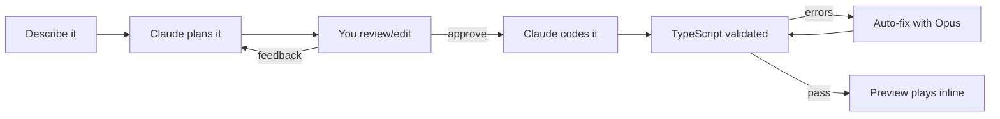
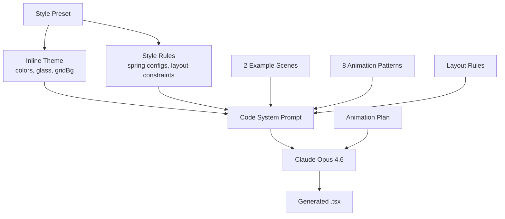
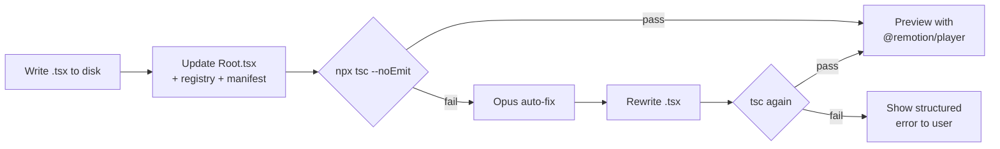

# Animotion

Describe an animation in plain English. Get a production-ready Remotion scene with live preview.

Animotion uses Claude to turn natural language prompts into React-based video animations. You describe what you want, review a structured plan, tweak the timing, approve it, and get a working `.tsx` component — previewed inline and ready to render to MP4.

**BYOK** — Bring Your Own Key. You need an Anthropic API key with access to Claude Opus and Sonnet.

## How it works



1. Pick a style (Professional, Playful, or Standard) and type a prompt
2. Claude generates a structured plan with phases, timing, and visual elements — streamed live
3. Review the plan, edit timing, or submit feedback to revise it
4. Approve — Claude Opus generates the full TSX component, streamed token by token
5. The file is written, TypeScript-validated (auto-fixed if needed), and registered in Remotion
6. A live preview plays inline via `@remotion/player` with playback controls

## Quick start

```bash
git clone https://github.com/rosekamallove/animotion.git
cd animotion

# Install web app dependencies
npm install

# Install Remotion project dependencies
cd remotion && npm install && cd ..

# Add your API key
cp .env.local.example .env.local
# Edit .env.local → ANTHROPIC_API_KEY=sk-ant-...

# Start the app
npm run dev
```

Open [http://localhost:3000](http://localhost:3000).

## Rendering to video

Generated scenes are written to `remotion/src/generated/` and auto-registered in `Root.tsx`.

```bash
cd remotion

# Preview in Remotion Studio
npx remotion studio

# Render to MP4 (1080p)
npx remotion render <SceneName> out/<SceneName>.mp4

# Render at 4K
npx remotion render <SceneName> out/<SceneName>.mp4 --scale=2
```

## Features

### Style presets

Three built-in styles that affect both planning and code generation:

| Style | Look | Animation feel |
|-------|------|---------------|
| **Professional** | White background, blue/violet, subtle shadows | Smooth fades only, no bounce |
| **Playful** | Warm pink background, thick borders, large corners | Bouncy springs, scale pops, rotation |
| **Standard** | Light gray, cyan/purple, glass-morphism cards | Mixed springs, grid overlay |

Each preset injects its own inline theme, spring configs, and design rules into the system prompt:



### Plan review pipeline

- Edit overall duration and FPS directly in the review card
- Adjust individual phase start/end times
- Submit text feedback — Claude revises the plan while keeping context
- Revise as many times as needed before approving

### Streaming

- Plan generation streams a live structured preview (scene name, phases, elements fill in progressively)
- Code generation streams TSX token by token with a live line counter
- TypeScript validation shows step-by-step progress (write > validate > auto-fix)

### Write and validate pipeline



### In-browser preview

Generated scenes play inline via `@remotion/player` — no need to open Remotion Studio separately. Full playback controls, loop, and scrubber.

### Session persistence

Your prompt, plan, style, and generated code persist in `sessionStorage`. If something fails or you refresh, you pick up where you left off. "Start Over" clears the session.

## Project structure

```
animotion/
  app/                        Next.js app (UI + API routes)
    api/
      generate-plan/           SSE stream: prompt > structured plan
      generate-code/           SSE stream: plan > TSX code
      write-scene/             Write file, validate TS, auto-fix
    components/
      RemotionPreview.tsx      @remotion/player wrapper
      CodeBlock.tsx            Shiki syntax-highlighted code block
  lib/
    claude.ts                  Anthropic SDK: plan, revise, code, fix
    prompts.ts                 Style-aware system prompts
    styles.ts                  Professional / Playful / Standard presets
    remotion-writer.ts         File writer + Root.tsx auto-registration
  remotion/                    Remotion project (separate package.json)
    src/
      Root.tsx                 Composition registry (auto-modified)
      generated/               AI-generated scenes land here
      TurboQuant/              Hand-crafted example scenes
```

## Models

| Step | Model | Why |
|------|-------|-----|
| Planning | Claude Sonnet 4.6 | Fast structured output via tool_use |
| Code generation | Claude Opus 4.6 | Best code quality for complex layouts |
| Auto-fix | Claude Opus 4.6 | Fixes TypeScript errors if first pass fails |
| Plan revision | Claude Sonnet 4.6 | Multi-turn: sees original plan + feedback |

## Prompt tips

**Be specific about the visual:**
> Show 8 horizontal bars stacking up with a GPU memory thermometer that turns red when full, then shakes

**Mention timing:**
> 10-second scene, bars appear in the first 3 seconds, overflow happens at 6 seconds

**Reference animation types:**
> Bouncy pop-in for cards, smooth fade for text, shake effect when it overflows

**Non-technical topics work great too:**
> Marketing funnel with 10,000 visitor dots narrowing through Awareness, Consideration, Conversion stages with drop-off counts

## Requirements

- Node.js 18+
- Anthropic API key with access to Claude Opus 4.6

## License

BSL-1.1
